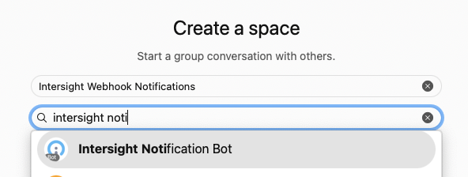
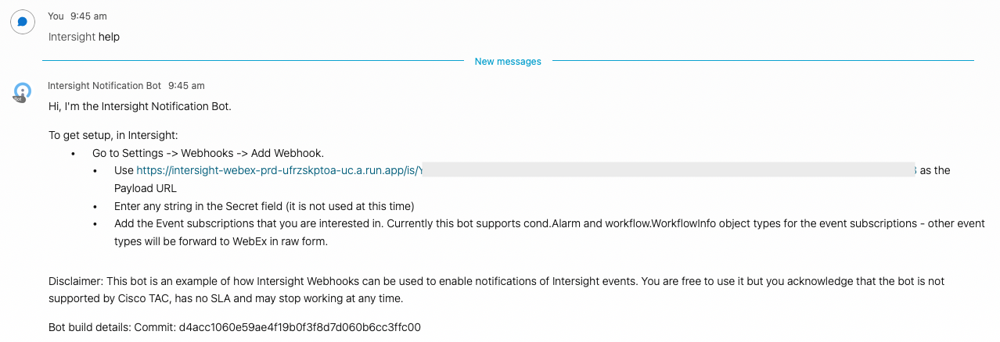
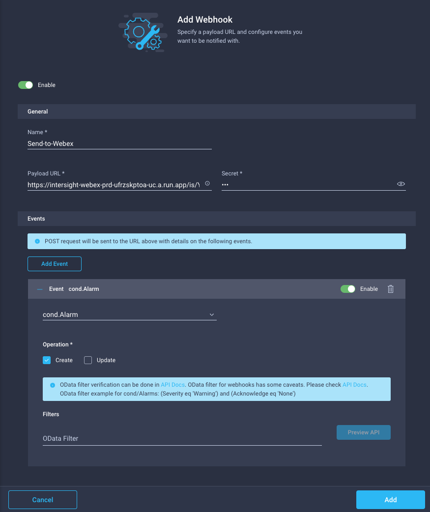

# Intersight Webhook Notifier

This is a WebEx bot that receives webhook events from Intersight and relays them to WebEx spaces. The hosted bot is free to use subject to the disclaimer below and the code is hosted here if you would like to host an instance yourself.

**Disclaimer:** This bot is an example of how Intersight Webhooks can be used to enable notifications of Intersight events. You are free to use it but you acknowledge that the bot is not supported by Cisco TAC, has no SLA and may stop working at any time. See [LICENSE](LICENSE) for more details. 

## Using the hosted bot

1. Create a new space and add the bot (Intersight Notification Bot <intersight-notifier-prd@webex.bot>) as well as anyone else who wants to receive notifications:

2. Send a message @mentioning the bot, it will then respond back with instructions on how to configure the Intersight Webhooks:

3. Follow the bot's instructions - in Intersight, go to Settings -> Webhooks -> Add Webhook. 
	* Enter the Payload URL as specified by the bot
	* Enter any string in the Secret field (it is not used at this time)
	* Add the Event subscriptions that you are interested in. Currently this bot supports cond.Alarm and workflow.WorkflowInfo object types for the event subscriptions - other event types will be forward to WebEx in raw form. 

## Deploying your own instance of the bot

The bot is designed to run on Google Cloud Run. 

Detailed deployment instructions coming soon.

## Feedback/Contributions

Please create a GitHub issue to report any problems with the hosted bot or the code. Pull Requests are welcome but please create an issue first. 
